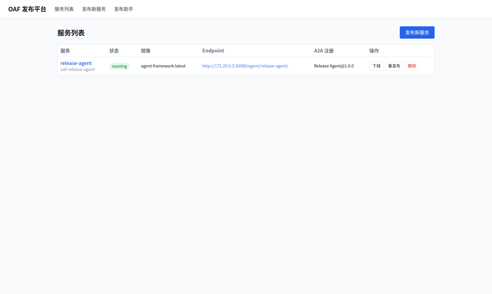
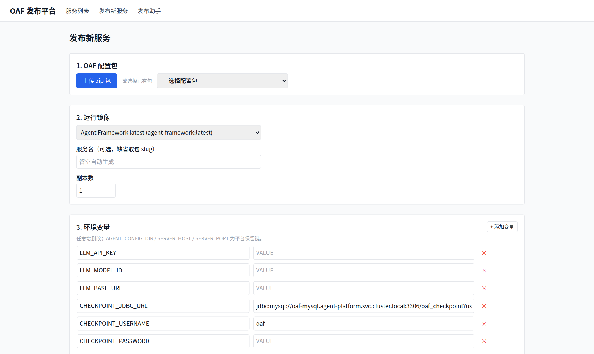
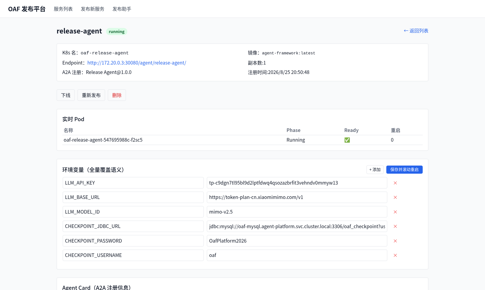
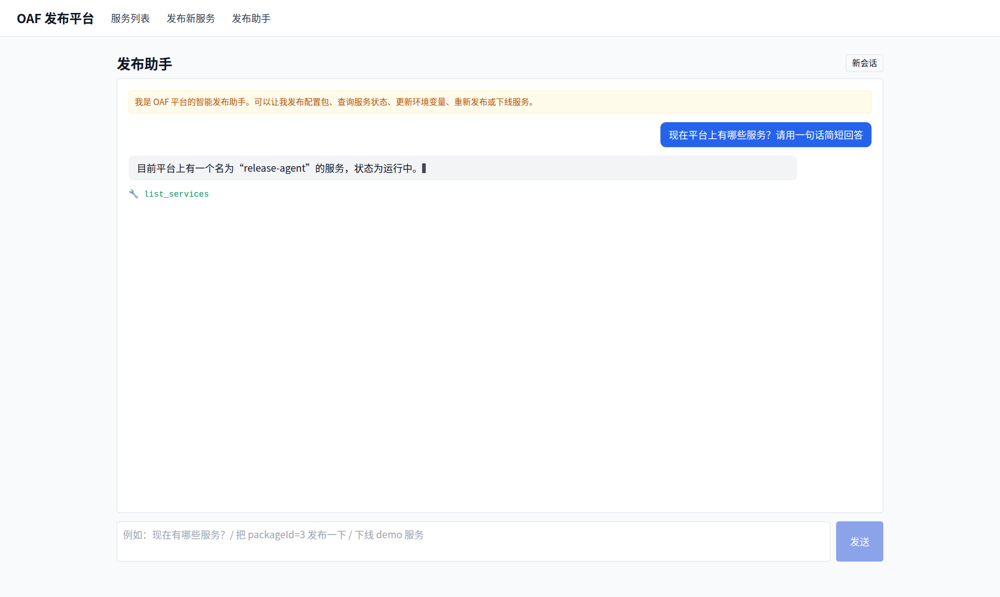

# OAF 服务发布平台（Agent Manager v2）

上传符合规范的 **OAF 配置包** → K8s 原生 Deployment/Service/Ingress 拉起服务 → 自动经 A2A 接口注册服务信息 → 列表/状态管理/重新发布。核心能力同时以 **MCP 服务**暴露，并由基于 agent-framework 的 **智能发布助手**（对话式操作）自举运行于集群内。

> 设计文档：[REDESIGN.md](REDESIGN.md)（含 v1→v2 重构决策与实施记录）
> 历史版本：git tag `v1-archive`

## 架构

```
                浏览器 :8911（宿主机 nginx 统一入口）
                  /                    \
           前端 UI                   /api/*、/mcp
     platform-frontend          platform-backend (Go)
     (Next.js, :30881)          REST + MCP 同进程
                                     │ client-go
        ┌────────────────────────────┼─────────────────────────┐
        ▼                            ▼                         ▼
  Deployment oaf-*            Service oaf-*-svc          Ingress oaf-*
  包: PVC subPath → /config   ClusterIP :8100            path /agent/{name}
  env: ConfigMap envFrom                                 (x-forwarded-prefix)
        │
        ▼
  业务 Pod（agent-framework 等兼容镜像，AGENT_CONFIG_DIR=/config）
        └── 就绪后由平台拉取 /.well-known/agent-card.json 注册入库

  release-agent：平台自举发布的第一个服务，经 MCP 驱动整个发布流程
```

## 技术栈

| 层 | 选型 |
|----|------|
| 管理后端 | Go 1.23 + Gin + GORM + client-go（REST `/api/v1` 与 MCP streamableHttp `/mcp` 同进程） |
| MCP SDK | modelcontextprotocol/go-sdk v1.3.1 |
| 前端 | Next.js 16 + React 19 + Tailwind（3 页面 + 发布助手对话） |
| 业务运行时 | agent-framework（Java/Spring Boot :8100，AgentScope Harness 2.x） |
| 元数据库 | 集群内 MySQL 8.0（`oaf_platform` / `oaf_checkpoint` 两库） |
| 存储 | 共享 PVC `platform-data`（包只读挂 /config + 可写工作区 /workspace） |
| 集群 | Kind 单节点 + ingress-nginx |

## 入口

| 入口 | 地址 |
|------|------|
| 统一入口 | http://100.66.1.5:8911 |
| 前端直连 | http://172.20.0.3:30881 |
| REST API | http://localhost:30080/api/v1 |
| MCP | http://localhost:30080/mcp |
| 发布助手对话页 | http://100.66.1.5:8911/assistant |

## 快速开始

```bash
# 构建 + 导入镜像 + 部署全流程
see docs/deployment.md
```

开发态：

```bash
cd backend && make test          # go vet + 单测
cd backend && make run-dev       # 宿主机直跑后端（KUBECONFIG 回退）
cd frontend && npm run dev       # 前端热更
```

## 项目结构

```
agent-manager/
├── backend/            # Go 管理后端（REST+MCP+K8s+DB）
├── frontend/           # Next.js 前端（列表/发布向导/详情/助手对话）
├── agent-framework/    # 业务 Agent 运行时（Java，A2A/单次流/Debug Console）
├── release-agent/      # 智能发布助手的 OAF 包（mcp-configs → 平台 MCP）
├── manifests/          # 平台自举清单（ns/PVC/RBAC/MySQL/backend/frontend/ingress）
├── e2e/                # 全流程回归脚本（A~E 场景 + chat/debug-console）
├── docs/               # 部署指南与规范参考
└── REDESIGN.md         # 重构设计文档（权威）
```

## 界面展示

### 服务列表（状态轮询 / 生命周期操作）



### 发布向导（上传 OAF 包 → 选镜像 → 编辑环境变量）



### 服务详情（实时 Pod / A2A Agent Card / env 滚动重启 / 事件时间线）



### 发布助手对话（自然语言驱动发布全流程，支持 HITL 确认卡片）



> 截图为真实运行界面，可通过 `cd e2e && node screenshot-v2.js` 重新生成。

## 测试与回归

```bash
cd backend && go test ./...              # 单元测试
cd e2e && ./platform-e2e.sh             # A/B：REST 主链路 + 动作矩阵
cd e2e/mcpclient && go run . -zip ../fixtures/demo-agent-v1.zip   # C：MCP 全链路
cd e2e && node ui-e2e.js                # D：UI 流程
cd e2e && ./agent-e2e.sh                # E：发布助手自然语言驱动
node debug-console-e2e.js / chat-ui-e2e.js   # Debug 页 / 对话页
```

## 注意事项

- OAF 包要求：根级 `AGENTS.md`（frontmatter 必填校验为宽松模式，引用缺失仅 warnings）
- 平台保留键（用户 env 不可覆盖）：`AGENT_CONFIG_DIR`、`AGENT_WORKSPACE_DIR`、`SERVER_HOST`、`SERVER_PORT`
- MCP server 不可达默认不阻断业务启动；必需依赖在包内声明 `startup.required: true`
- 敏感配置在 `.env.secrets`（gitignored）；MySQL 凭据见 `manifests/platform.yaml`
