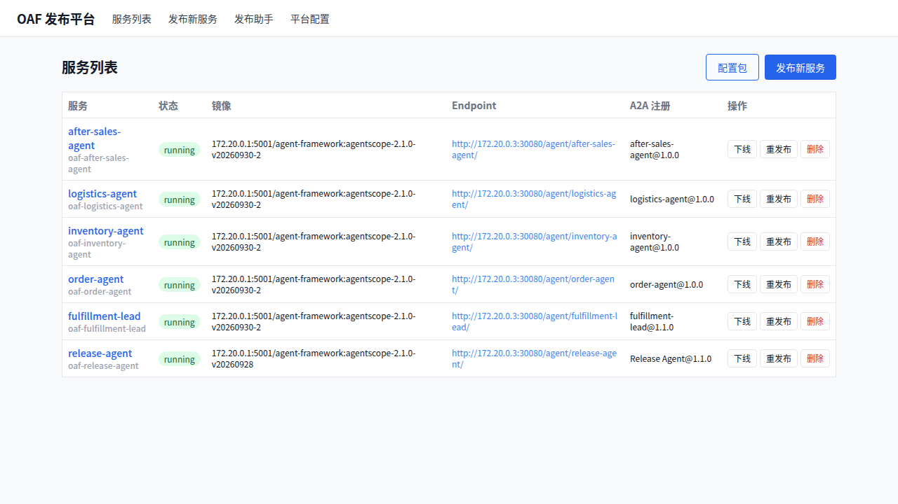
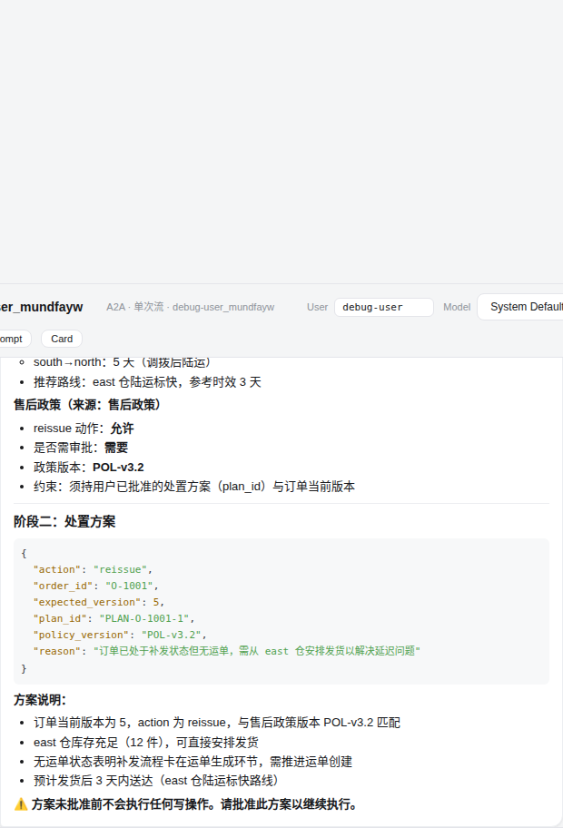
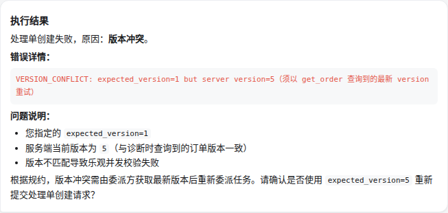
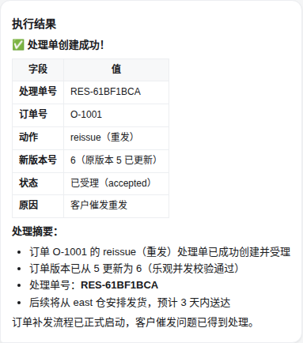
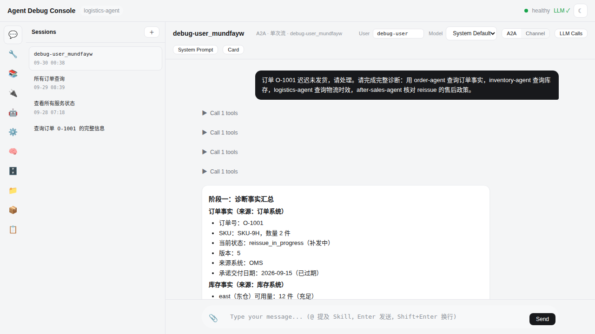

# order-fulfillment Demo 演示部署指南

> 对齐 [AgentScope Java 官方 order-fulfillment 案例](https://java.agentscope.io/v2/zh/service/cases/order-fulfillment)
> 的**完整用例演示**：官方案例给出 5 agent 协作 + 6 业务工具 + 诊断→审批→执行闭环的参考语义，
> 本 demo 在 OAF 平台上将其完整落地（官方案例未给出可运行的工程形态与部署方式），
> 并叠加平台侧的远程子 agent 编排（Agent Protocol）、三级权限防线与幂等 Job 端点。
>
> - 当前部署状态：**5 服务 running，e2e 28/28 通过**（2026-09-30，镜像 `agentscope-2.1.0-v20260930-2`）
> - 一键部署：`./deploy.sh`；端到端验证：`node e2e/order-fulfillment-e2e.mjs`

---

## 1. 拓扑与官方案例映射

| 官方案例要素 | 官方语义 | 本 demo 实现 |
|---|---|---|
| fulfillment-lead（Leader） | 组织调查、分阶段委派、输出结论 | OAF 包提示词编排（诊断四委派 → 方案 → 批准后执行） |
| order-agent | 查订单/版本 | 远程子 agent（`get_order`） |
| inventory-agent | 查各仓可用量 | 远程子 agent（`get_inventory`） |
| logistics-agent | 运单事实与时效依据 | 远程子 agent（`get_logistics`） |
| after-sales-agent | 政策核对 + 处理单创建/查询 | 远程子 agent（`get_policy` / `create_resolution` / `get_resolution`） |
| 诊断 Team → approval → 执行 Team | Workflow 节点 | 两阶段提示词协议 + **RemoteConfirmBridge** 确认闸门（批准前零写） |
| 服务端授权校验（"approved 不算授权"） | 版本/幂等/批准记录硬校验 | biz-mcp 服务端 L3：`expected_version` 乐观并发 + `plan_id` 幂等 |
| Job Endpoint（Idempotency-Key） | `/invoke/v1/endpoints/order-triage/jobs` | 平台 `POST /api/v1/services/:id/jobs`（`a2a_jobs` 映射表） |
| 五应用独立部署 + External Agent 注册 | Aistio Service | 5 个 OAF 服务经平台发布，A2A agent-card 自动注册 |

业务工具由 `mcp/biz_mcp.py`（Python 标准库 streamableHttp MCP，零依赖）实现，6 个工具的
入参与返回契约对齐官方工具表；L3 校验在服务端强制，**不信任任何模型自述**。

```
用户 ──► fulfillment-lead（lead，协议关）
           │ agent_spawn（Agent Protocol，token 鉴权）
           ▼
   ┌─────────┬─────────┬──────────────┐
order-agent  inventory  logistics   after-sales   （4 member，协议开）
 get_order    get_inventory  get_logistics  get_policy/get_resolution
                                          create_resolution（L3 硬校验）
           │
           ▼
        biz-mcp:8300（业务 mock，内存态）
```

## 2. 前置条件

1. kind 集群 `agent-manager` 存活，namespace `agent-platform` 内 platform-backend / oaf-mysql /
   oaf-redis / ingress-nginx 运行中；宿主机 nginx `:8911` 统一入口可用。
2. 框架镜像已推送：`172.20.0.1:5001/agent-framework:latest`（≥ `agentscope-2.1.0-v20260930-2`，
   含 M1 收尾迭代与 CR 修复）。
3. release-agent 服务 running（deploy.sh 从它的 CM/Secret 派生平台基础设施 env：
   MySQL/Redis/checkpoint/LLM 配置）。
4. **有效的 LLM API Key**（demo 用 MiMo `mimo-v2.5`）：写在 `.env.secrets` 的 `LLM_API_KEY`，
   或发布后经平台「服务详情 → 编辑 env」更新 `LLM_API_KEY`（敏感键，走服务 Secret）。
   LLM 失效的典型症状：会话回复"Handle Agent execute error ... 401 Invalid API Key"。
5. 平台镜像白名单（`AVAILABLE_IMAGES`）包含所用框架镜像 tag。

## 3. 一键部署

```bash
cd demo/order-fulfillment
./deploy.sh
```

脚本动作：① 渲染并应用 biz-mcp（ConfigMap 内嵌脚本）；② 打包上传 5 个 OAF 包并经平台 API
发布 5 个服务（lead 协议关 + `AGENT_REMOTE_HEADERS_JSON` 注入 token；4 member 协议开 +
`AGENT_PROTOCOL_AUTH_TOKEN`，走服务 Secret）；③ 轮询等待全部 running + A2A 注册完成。

> 注意：deploy.sh 是**首次一键部署**语义（每次生成新 demo token）。已部署环境的增量更新
> （换包/换镜像/改 env）走平台 API：`POST /services/:id/republish`（可选 `packageId`/`image`）
> 与 `PATCH /services/:id/env`（env 全量覆盖、敏感键三态）。

部署完成后：服务列表应看到 5 个 demo 服务全部 running 并完成 A2A 注册：



## 4. 演示剧本（Debug Console，约 10 分钟）

入口：`http://127.0.0.1:8911/agent/fulfillment-lead/debug`（lead 的 Debug Console → Chat）。
以下剧本为一次完整实测的会话流（截图即真实运行）。

### 第一幕：完整诊断（四专员委派，全程只读）

向 lead 发起：

> 订单 O-1001 迟迟未发货，请处理。请完成完整诊断：用 order-agent 查询订单事实，
> inventory-agent 查询库存，logistics-agent 查询物流时效，after-sales-agent 核对 reissue 的售后政策。

lead 依序远程委派四个专员（每个都是独立 OAF 服务上的 Agent Protocol 任务），收割结果后输出
"阶段一：诊断事实汇总"（订单/库存/物流/售后政策四段事实，注明来源）与"阶段二：处置方案"
（JSON 携带 `expected_version` / `plan_id` / `policy_version`），并明确
**"方案未批准前不会执行任何写操作"**：



### 第二幕：L3 防线（故意用过期版本批准）

> 我批准此方案，按以下参数执行：order_id=O-1001，action=reissue，**expected_version=1**，
> plan_id=PLAN-O-1001-1，reason=客户催发重发。

lead 逐字委派 after-sales-agent → biz-mcp 服务端乐观并发校验拒绝（**VERSION_CONFLICT**）→
成员如实回报错误全文、不自行改数 → lead 转述失败原因并请求正确版本。
这一幕证明：写路径的授权与并发校验在**服务端**，模型/用户口的"批准"不是授权：



### 第三幕：正确版本执行与交付

> 确认，请使用 expected_version=5 重新提交（其余参数不变）。

成员以正确版本创建处理单成功：真实单号 `RES-61BF1BCA`、订单版本 5→6、状态已受理：



### 第四幕（可选）：member 侧视角

打开任一成员的 Debug Console（如 `/agent/logistics-agent/debug`）：除自身任务会话外，
还能看到经 Agent Protocol PROPAGATE 透传的父会话事件流——这正是 e2e 中"幽灵卡治理（F20）"
所治理的转发语义，演示时可作为架构讲解点（父流可见、决策必须走远程行）：



### 附加演示点：幂等 Job 端点（平台侧）

```bash
# 同键重复提交返回同一 taskId，绝不重复执行（对齐官方 order-triage Job Endpoint 语义）
curl -X POST http://127.0.0.1:8911/api/v1/services/<serviceId>/jobs \
  -H 'Content-Type: application/json' -H 'Idempotency-Key: demo-001' \
  -d '{"text":"查询 warehouse-1 的当前库存数量"}'
# 重放同键 → {"idempotent": true, "job": {"taskId": "<同一锚点>"}, ...}
curl http://127.0.0.1:8911/api/v1/services/<serviceId>/jobs/demo-001   # 查映射
```

## 5. 端到端验证

```bash
node e2e/order-fulfillment-e2e.mjs
```

28 项断言（框架保证确定性，模型话术宽松观察），当前 **28/28 通过**：

| 组 | 断言 |
|---|---|
| T0 | 三服务健康 + mock 订单事实可查 |
| T1 | 远程诊断委派（agent_spawn）+ 诊断零写 + `get_order` 真实落 mock |
| T1b | member 直驱 `get_inventory` + 库存事实回流 |
| T2 | 方案（expected_version/plan_id）+ 引用本轮订单 + 等待批准 + **物流委派落 mock + 政策核对落 mock + 方案引用政策版本**（官方对齐扩展） |
| T3/T4 | 批准后写委派 + `create_resolution` 恰 +1 + plan_id 锚定与版本推进 + 真实 RES 编号回流 |
| T5/T6 | L3 服务端硬约束：VERSION_CONFLICT / IDEMPOTENT_REJECT（直连 biz-mcp 断言） |
| T7 | 4 个协议成员 `/tasks` 无 token 一律 401（经 Ingress，验收断言 11） |

## 6. 清理

不需要演示时，在平台服务列表依次「删除」5 个 demo 服务（OAF 包与 PVC subPath 一并回收）；
biz-mcp 保留无碍（内存态、无副作用）。彻底清理：

```bash
kubectl -n agent-platform delete deployment/biz-mcp service/biz-mcp configmap/biz-mcp-script
```

## 7. 故障排查

| 症状 | 原因与处置 |
|---|---|
| 会话回复 "401 Invalid API Key" | 成员 LLM key 失效：`PATCH /services/:id/env` 更新 `LLM_API_KEY`（走服务 Secret），滚动后自愈 |
| 幂等 Job 返回 409 in progress | 同键有在途认领（blocking 发送中或结果未知的保守保留）；持同键稍后重试，认领租期（2×超时+60s）过期自动接管 |
| 幂等 Job 返回 "a2a response has no task id" | 成员端 A2A 响应形态异常；确认框架镜像 ≥ v20260930-2（含 result.taskId 解析） |
| 子 agent 委派后无结果 | 查 lead 日志 `[RemoteConfirmBridge]`；member 侧 `/tasks` 需 token（X-Agent-Protocol-Token，与 lead headers JSON 同值） |
| biz-mcp 重启后工具调用失败 | 不会——biz MCP 为 streamableHttp（每次调用新建连接）；demo 三服务经实测重启透明 |
